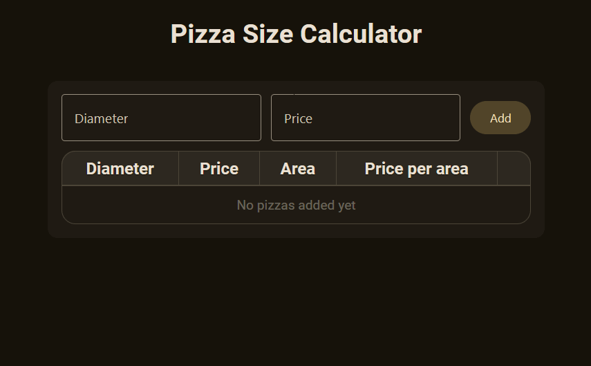

# 🍕 [Pizza Size Calculator](https://mathklk.github.io/PizzaSize-V2/dist/index.html) 🍕

Website for calculating and comparing pizza sizes.

## Dependencies

- nodejs (`winget install OpenJS.Nodejs`)
- rollup npm package (`npm install rollup`)
- Material-Web (will be installed automatically by rollup)

## Rollup usage

`npx rollup -p @rollup/plugin-node-resolve <source_file>.js -o <rolled_up_file>.js`
(configured as vscode task)
